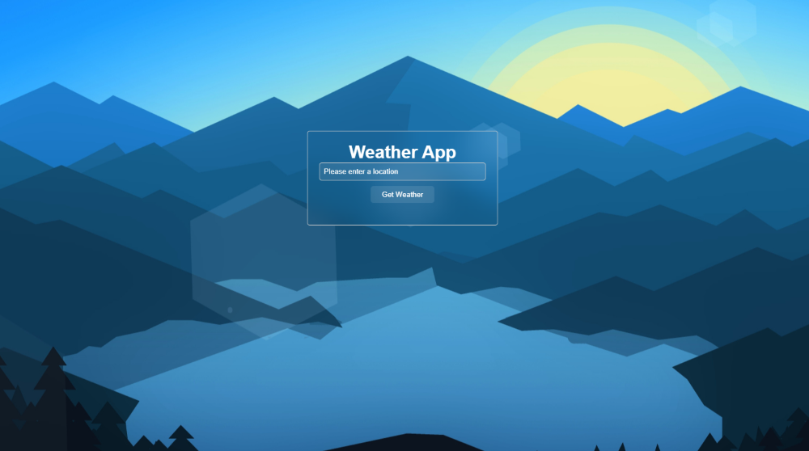
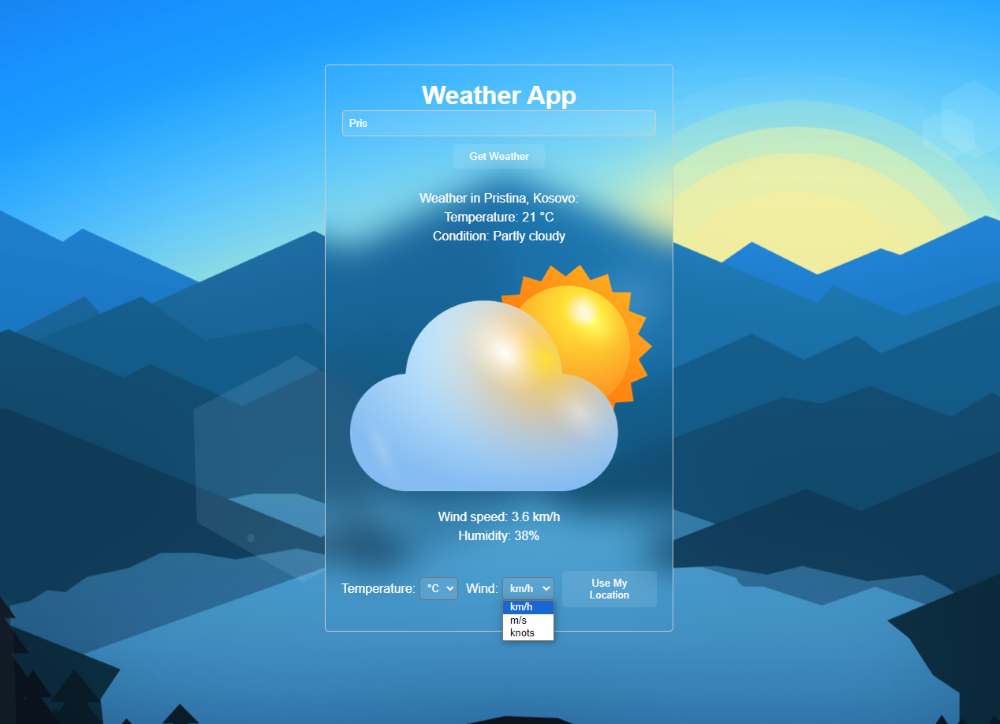

# WeatherApp

### The logo of our program

This web application allows users to get weather information for any location worldwide.

## Overview

This application is built using HTML, CSS, and JavaScript. It utilizes the API from [WeatherAPI](https://www.weatherapi.com/) to fetch current weather information.

### Start window

### Second window

## Features

- Search weather by city name
- Display weather conditions (temperature, humidity, wind speed, etc.)
- Visual representation of weather condition

## Installation

1. Clone the repository: `git clone https://github.com/Wertoquri/WeatherApp.git`
   
2. Open the `index.html` file in your web browser.

## Usage

1. Enter the city name in the input field.
2. Click the "Search" button.
3. The weather information will be displayed on the screen.

## Contribution

If you would like to contribute, please create a Pull Request with your suggestions.

## Authors

- wertoquri
- Gsjwhrbf

## License

This project is licensed under the [MIT License](https://github.com/Wertoquri/WeatherApp/blob/main/LICENSE).
